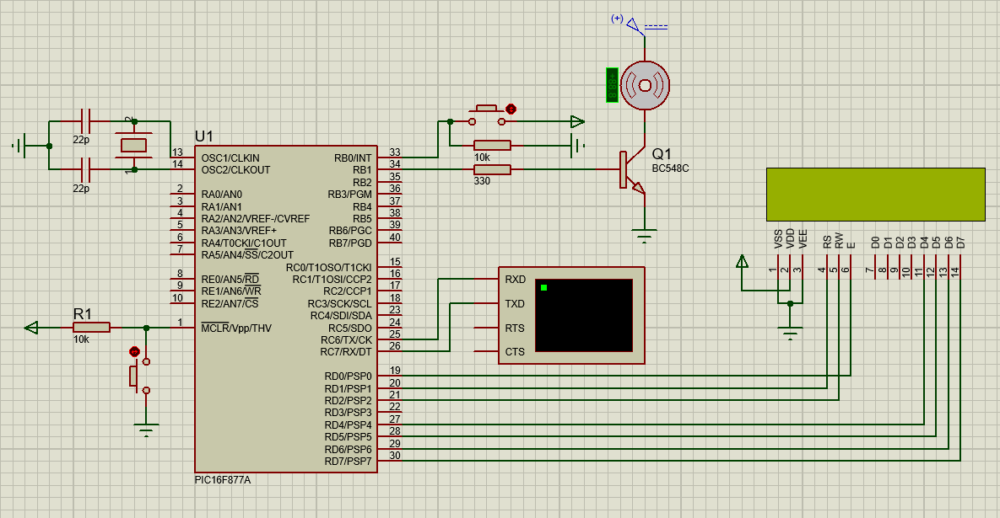

# `PIC16F877A` Control de un Motor DC mediante comunicación RS-232

Este proyecto utiliza un microcontrolador PIC16F877A para controlar la velocidad de un motor DC mediante la comunicación RS-232 y también se muestra la información en una LCD, Así como también cuenta con un botón para parar el motor en cualquier momento

## Componentes
- Microcontrolador: PIC16F877A
- Motor DC
- Botón
- Pantalla LCD
- Transistor 

## Herramientas de Desarrollo
- Proteus 11 para la simulación
- Lenguaje de programación: C

## Archivos del Proyecto
- `Código fuente` : "DC_Motor_Control_RS232.c"
- Archivo .hex para la programación del microcontrolador
- Archivo .cof para depuración

## Diagrama de Conexión
- Se incluye una imagen PNG que muestra el diagrama de conexión entre los componentes
- También se añade la simulación realizada en Proteus

## Licencia
Este proyecto está bajo la licencia MIT. Consulta el archivo `LICENSE` para obtener más detalles.

-------------------------------

# `PIC16F877A` DC Motor Control via RS-232 Communication

This project uses a PIC16F877A microcontroller to control the speed of a DC motor through RS-232 communication and also displays the information on an LCD. It also has a button to stop the motor at any time.

## Components
- Microcontroller: PIC16F877A
- DC Motor
- Button
- LCD Screen
- Transistor

## Development Tools
- Proteus 11 for simulation
- Programming language: C

## Project Files
- `Source code` : “DC_Motor_Control_RS232.c”
- .hex file for microcontroller programming
- .cof file for debugging

## Connection Diagram
- A PNG image is included that shows the connection diagram between the components
- The simulation performed in Proteus is also added

## License
This project is under the MIT license. Check the LICENSE file for more details.

-------------------------------

 

